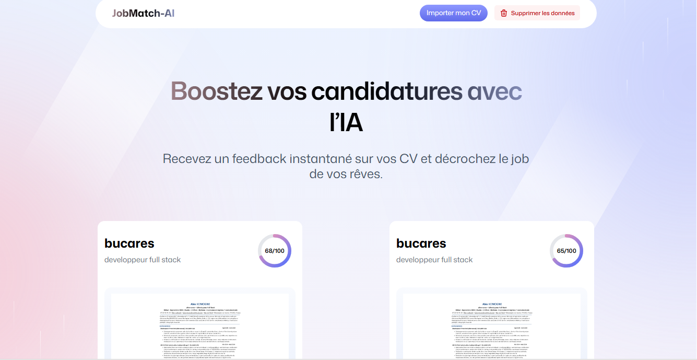
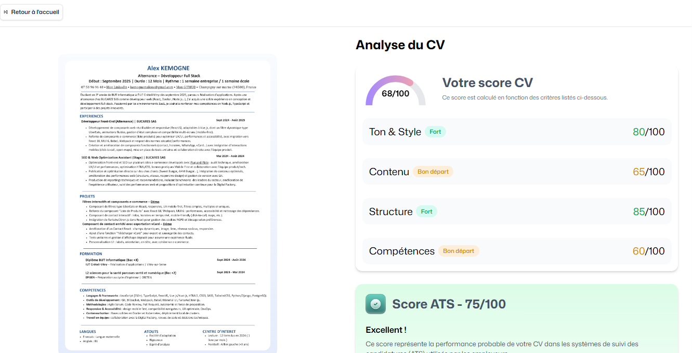

<div align="center">
  
  
  
  <h1>JobMatch-AI</h1>
  <p align="center">
    <strong>L'IA qui révolutionne le recrutement en analysant et évaluant les CV avec précision</strong>
  </p>
  
  <p align="center">
    <a href="https://jobmatch-ai-000z2.puter.site/" target="_blank">
      
    </a>
    <a href="https://github.com/KemogneAlex/jobmatch-ai" target="_blank">
      
    </a>
  </p>
  
  <p align="center">
    
    
    
    
  </p>

  *Transformez vos CV en opportunités professionnelles avec l'analyse IA avancée*
</div>

## ✨ Fonctionnalités Principales

### 📊 Analyse Complète des CV
- **Évaluation ATS** : Détection des mots-clés et optimisation pour les systèmes de suivi des candidats
- **Score global** : Note sur 100 avec indicateurs visuels clairs
- **Analyse détaillée** par catégorie :
  - Structure et mise en page
  - Contenu et pertinence
  - Compétences techniques
  - Style et ton

### 🚀 Gestion Intuitive
- **Tableau de bord** : Vue d'ensemble de tous vos CV
- **Téléchargement simple** : Glissez-déposez vos fichiers PDF
- **Recherche rapide** : Trouvez facilement vos CV
- **Suppression sécurisée** : Gestion individuelle ou groupée des documents

### 🔒 Sécurité des Données
- Chiffrement des données sensibles
- Authentification sécurisée
- Stockage cloud privé avec Puter


## 🛠️ Installation

### Prérequis
- Node.js 16+
- npm ou yarn
- Compte Puter (pour le stockage cloud)

### Instructions d'installation

1. **Cloner le dépôt**
   ```bash
   git clone https://github.com/KemogneAlex/jobmatch-ai.git
   cd jobmatch-ai
   ```

2. **Installer les dépendances**
   ```bash
   npm install
   # ou
   yarn
   ```

3. **Lancer l'application**
   ```bash
   npm run dev
   # ou
   yarn dev
   ```

5. **Accéder à l'application**
   Ouvrez [http://localhost:5173](http://localhost:5173) dans votre navigateur.

## 🖥️ Technologies Utilisées

### Frontend
- **React 18** avec Hooks
- **TypeScript** pour un code robuste
- **Vite** pour un développement ultra-rapide
- **Tailwind CSS** pour un design moderne et responsive
- **React Router** pour la navigation

### Backend & Stockage
- **Puter** pour le stockage cloud sécurisé
- **PDF.js** pour le traitement des fichiers PDF
- **React Hot Toast** pour les notifications utilisateur

### Outils de Développement
- **ESLint** et **Prettier** pour la qualité du code
- **Git** pour le contrôle de version
- **Vite Plugin PWA** pour une expérience application native

## 📂 Structure du projet

Voici une vue d'ensemble de l'architecture du projet :

```
jobmatch-ai/
├── app/                    # Dossier principal de l'application
│   ├── components/         # Composants React réutilisables
│   │   ├── Navbar.tsx      # Barre de navigation principale
│   │   ├── ResumeCard.tsx  # Carte d'affichage des CV
│   │   ├── ScoreCircle.tsx # Composant de score visuel
│   │   └── ...             # Autres composants
│   │
│   ├── lib/                # Utilitaires et logique métier
│   │   ├── openai.ts       # Configuration et appels à l'API OpenAI
│   │   └── puter.ts        # Configuration de Puter
│   │
│   ├── routes/             # Routes de l'application
│   │   ├── home.tsx        # Page d'accueil
│   │   ├── upload.tsx      # Page de téléchargement de CV
│   │   ├── resume.$id.tsx  # Détail d'un CV
│   │   └── wipe.tsx        # Nettoyage des données
│   │
│   ├── types/              # Définitions TypeScript
│   │   └── index.ts        # Types globaux de l'application
│   │
│   ├── app.css             # Styles globaux
│   ├── root.tsx            # Point d'entrée de l'application
│   └── routes.ts           # Configuration des routes
│
├── public/                 # Fichiers statiques
│   ├── images/             # Dossier des images
│   │   ├── image1.png      # Capture d'écran 1
│   │   ├── image2.png      # Capture d'écran 2
│   │   ├── pdf.png         # Icône PDF
│   │   └── resume_*.png    # Autres captures d'écran
│   ├── icons/              # Icônes de l'application
│   ├── pdf.worker.min.mjs  # Worker pour le traitement PDF
│   └── favicon.ico         # Icône du site
│
├── constants/              # Constantes de l'application
├── types/                  # Types globaux
├── package.json            # Dépendances et scripts
└── tsconfig.json           # Configuration TypeScript
```

### 🏗️ Architecture technique

- **Frontend** : Application React avec TypeScript
- **Styling** : Tailwind CSS pour un design moderne et réactif
- **Gestion d'état** : Contexte React et hooks personnalisés
- **Routage** : React Router pour la navigation
- **Déploiement** : Application statique déployée sur Puter

## 🚀 Déploiement

### Pour la production
```bash
npm run build
# ou
yarn build
```

### Services recommandés
- **Puter** pour un déploiement rapide et simple (utilisé actuellement)
- **Vercel** pour l'hébergement frontend
- **Netlify** pour un déploiement simple avec des fonctions serverless
- **GitHub Pages** pour une solution gratuite

## 📄 Licence

Ce projet est sous licence [MIT](LICENSE).

## 📧 Contact

Pour toute question ou demande d'information, n'hésitez pas à me contacter :

📧 Email : kemognemalone@gmail.com

🔗 Lien du dépôt : [https://github.com/KemogneAlex/jobmatch-ai](https://github.com/KemogneAlex/jobmatch-ai)

🌐 Application en ligne : [https://jobmatch-ai-000z2.puter.site/](https://jobmatch-ai-000z2.puter.site/)

---

<div align="center">
  <p>Fait avec ❤️ par KEMOGNE</p>
  <p>© 2025 JobMatch-AI - Tous droits réservés</p>
</div>
